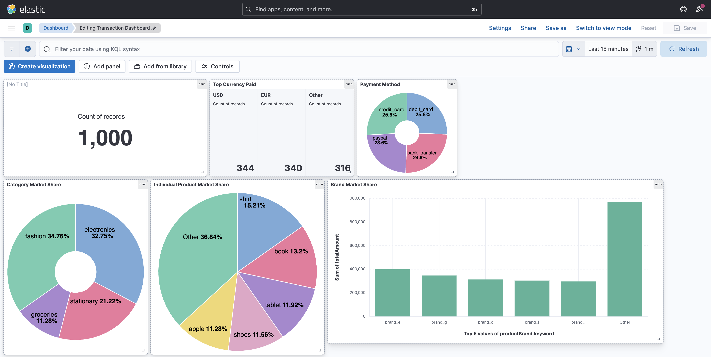
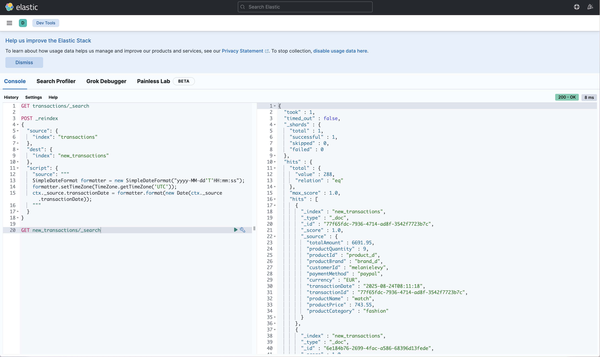

# Flink E-commerce Real-time Data Streaming

A real-time data streaming pipeline that processes e-commerce transactions using Apache Flink, Kafka, and Elasticsearch.

## Screenshots




## Tech Stack

- **Apache Kafka (Confluent)** - Message broker for real-time data streaming
- **Apache Zookeeper (Confluent)** - Distributed coordination service for Kafka
- **Apache Flink** - Stream processing framework for real-time analytics
- **PostgreSQL** - Relational database for data storage
- **Elasticsearch** - Search and analytics engine
- **Kibana** - Data visualization dashboard

## Prerequisites

- Docker and Docker Compose
- Java 11+
- Maven
- Python 3.10

## Project Structure

```
.
├── flink-ecommerce-java     # Flink job for processing the data
    ├── src/main/java/
        ├── deserializer/
            ├── TransactionDeserializer.java
        ├── dto/
            ├── Transaction.java
            ├── SalesPerCategory.java
            ├── SalesPerDay.java
            ├── SalesPerMonth.java
        ├── flink/ecommerce/
            ├── DataStreamJob.java
        ├── utils/
            ├── JsonUtil.java
    ├── Dockerfile            # Dockerfile for the Flink job
    ├── pom.xml               # Maven project file
├── python-producer          # Python producer for generating fake e-commerce transactions
    ├── src/
        ├── kafka-stream.py
    ├── Dockerfile            # Dockerfile for the Python producer
    ├── pyproject.toml
    ├── uv.lock
├── staticfiles/              # Screenshots
├── docker-compose.yaml       # Docker Compose file for the infrastructure
├── docker-compose.producer.yaml # Docker Compose file for the producer
```

## Architecture

```
Python Producer → Kafka → Flink → PostgreSQL + Elasticsearch → Kibana
```

The system generates fake e-commerce transactions, processes them in real-time to create sales aggregations, and stores results for analytics and visualization.

## Docker Containers

### Infrastructure Services

- **Zookeeper** (`confluentinc/cp-zookeeper:7.4.0`) - Kafka cluster coordination
- **Kafka Broker** (`confluentinc/cp-server:7.4.0`) - Message streaming platform
- **PostgreSQL** (`postgres:14.0`) - Relational database for structured analytics
- **Elasticsearch** (`docker.elastic.co/elasticsearch/elasticsearch:8.11.1`) - Search and analytics engine
- **Kibana** (`docker.elastic.co/kibana/kibana:8.11.1`) - Data visualization dashboard

### Application Services

- **Flink Job** (Custom Java app) - Stream processing engine that:
  - Consumes transaction data from Kafka
  - Performs real-time aggregations (sales per category/day/month)
  - Sinks data to PostgreSQL and Elasticsearch
- **Python Producer** (Custom Python app) - Generates fake e-commerce transactions including:
  - Products (electronics, fashion, stationary, groceries)
  - Customer data, payment methods, currencies
  - Random transaction patterns

## Data Flow

1. **Python Producer** generates realistic e-commerce transactions every 0.5-2 seconds
2. **Kafka** streams transaction events to topic `financial-transactions`
3. **Flink** processes transactions in real-time to calculate:
   - Sales per product category
   - Daily sales aggregations
   - Monthly sales summaries
4. **PostgreSQL** stores structured analytics data
5. **Elasticsearch** indexes data for fast search and analytics
6. **Kibana** provides real-time dashboards and visualizations

## Quick Start

### 1. Start Infrastructure

```bash
docker-compose up -d
```

### 2. Start Data Producer

```bash
docker-compose -f docker-compose.producer.yaml up -d
```

### 3. Access Services

- **Kibana Dashboard**: http://localhost:5601
- **Elasticsearch**: http://localhost:9200
- **Kafka**: localhost:9092
