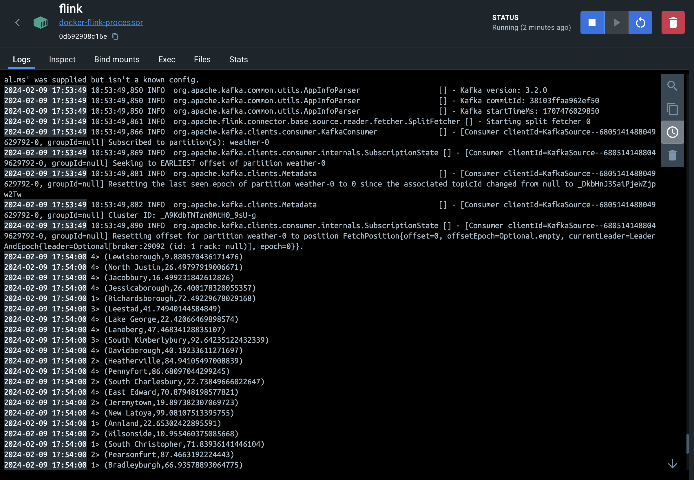
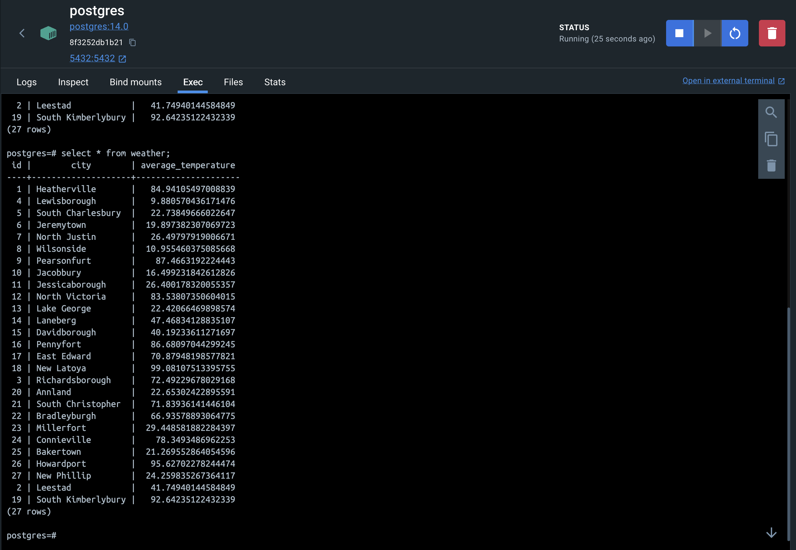

# kafka-flink-postgres

## Screenshots

## Tech Stack

- Apache Kafka (Confluent)
- Apache Zookeeper (Confluent)
- Apache Flink
- PostgreSQL

## Setup

- later

## References

- [Building a Real-Time Data Streaming Pipeline using Apache Kafka, Flink and Postgres](https://www.youtube.com/watch?v=FoypLT2W91c)
